# WebXR
## Introdunction
We conduct the first empirical study of web-based XR. 

We select the seven most popular frameworks for mobile XR in browsers and investigate their current capacity for
XR by evaluating their runtime performance, including 3D rendering, camera capturing, and real-world understanding.

The seven chosen frameworks are as follows:

* **Three.js** is a Javascript 3D library that aims to create an easy-to-use, lightweight, cross-browser, general-purpose 3D library.
* **React-three-fiber** is a React renderer for three.js.
*  **Babylon.js** tends to create a powerful, beautiful, simple, and open game and rendering engine.
* **A-Frame** is a web framework for building virtual reality experiences, which makes 3D worlds with HTML and entity-component.
*  **Playcanvas** aims to provide a fast and lightweight Javascript game engine build on WebGL and GLTF.
* **AR.js** is a javascript framework that supports augmented reality functions, including image tracking, location-based AR, and marker tracking.
* **MindAR.js** is a framework for web-based augmented reality, which provides image tracking and face tracking functions.

The characteristics of frameworks for web-based XR are shown in the following table.

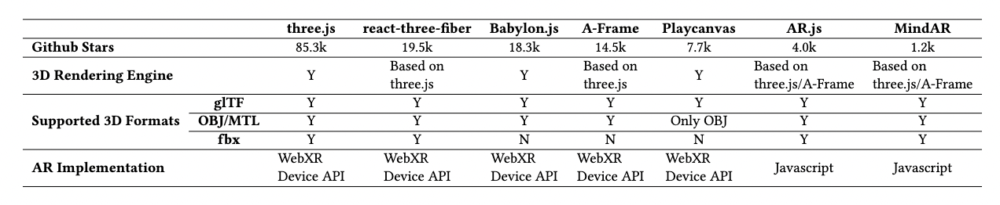

## How to use
Open different webpage on a mobile device, and the results, such as first loading time and FPS, will be logged to the web dev tool, and detailed metrics such as CPU scripting and GPU usage over time can be analyzed through profiling.

Codes of evaluating seven frameworks locate in `evaluteThree`, `evaluateReactThreeFiber`, `evaluvateBabylon`, `evaluateAframe`, evaluatePlaycanvas, `evaluateAR`, and `evaluateMindAR`. Enter these folders to see files for measuring VR and AR.

* `multigltf/multiobj/multifbx`: measure 3D rendering of gltf/obj/fbx models
* `multigltf-ar`: measure AR scene with gltf models

You can change the 3D model complexity by changing the number of 3D models rendered. You can also change models, and the models locate in `gltf/obj/fbx` folders.

Codes in `detailedAnalysis` provide the function for detailed analysis. First, use the web dev tool to profile and download the profiling result (JSON). Then, exact information from the JSON file. 

* `chrome-profiler/firefox-profiler/safari-profiler`: parsing and getting information from the profiled JSON file downloaded from Chrome/Firefox/Safari browser.

Bash files in `energy` are used to trace power

### Set up local server

You can use `http-server` to set up a local server. 

```sh
cd webXR
http-server -c-1
```
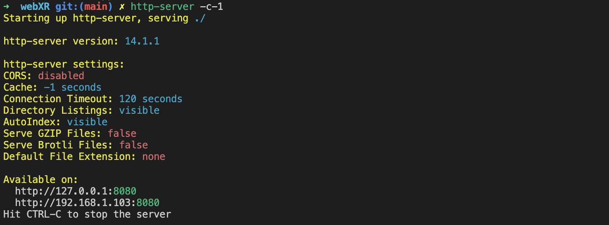

### Visit web page
After setting up a local server, open a web browser, and visit an address like `localhost:8080`. You can see the directories and files of this project. Click the `.html` file to visit the page, and you will see a button. Click the button to start the XR experiences.
<figure>
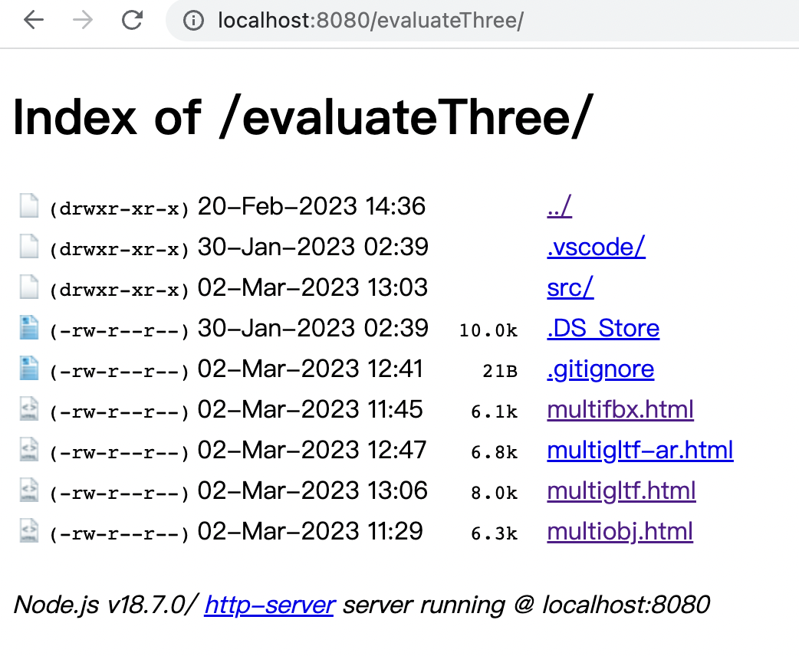
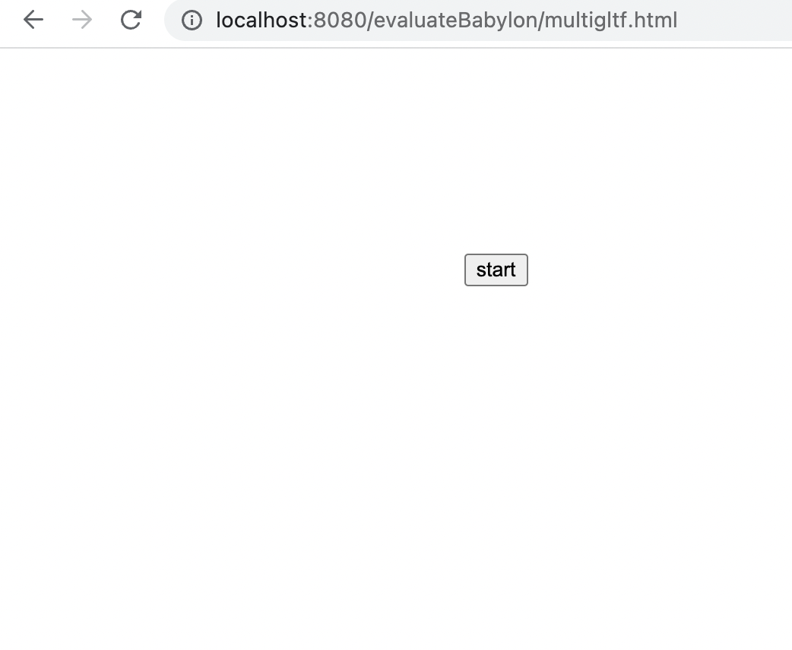
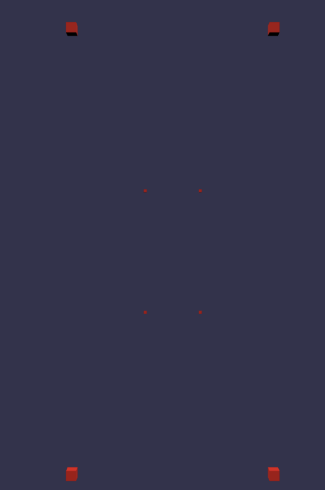
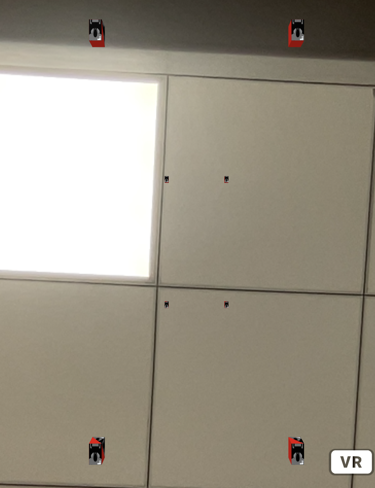
</figure>

To visit the web page on a mobile phone, you can connect your phone and PC to the same LAN. Another way is to use remote debug methods, like connecting the phone to PC via USB and visiting `chrome://inspect` on the PC. 

### Performance Analysis

The time of the click, scene calculation, scene rendering, FPS, and FT will be logged to the web dev tool. You can use the tool in `detailedAnaliysis` to get the time of network transferring and image decoding (Chrome, Firefox), CPU usage, and GPU usage (Chrome). 

#### chrome-profiler

Use performance in web dev tool to record and download the profiled file. `detailedAnalysis/chrome-profler/data/profiled-data.json` is an example.

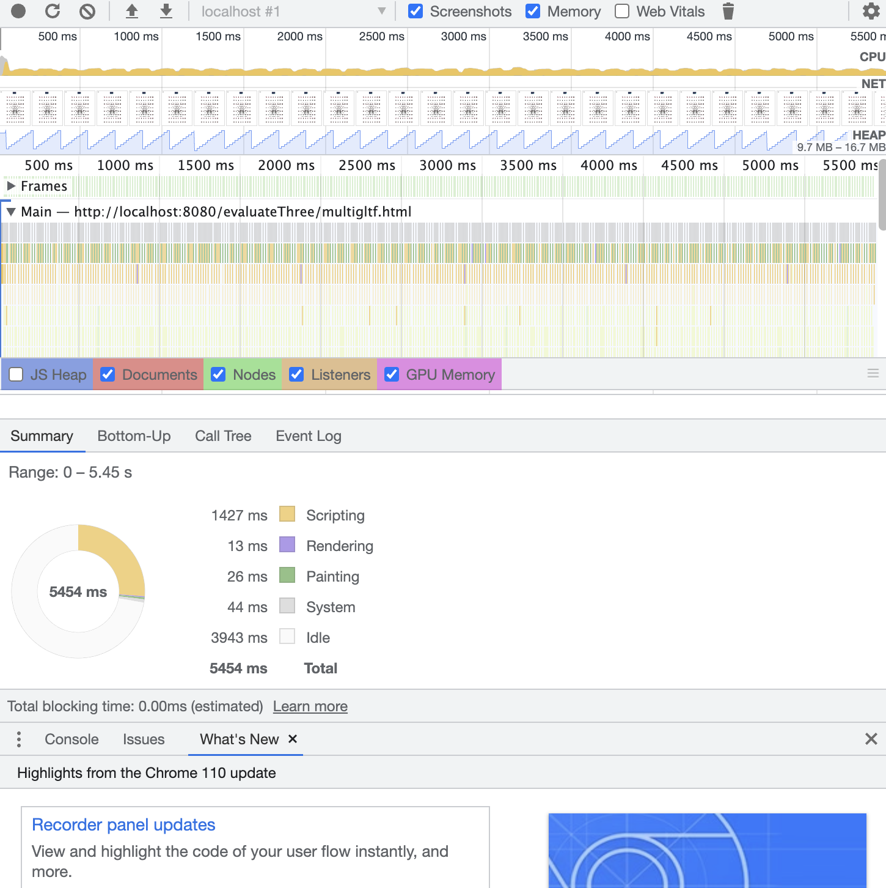

Use `getinfo.js` to get the time of the click, network transferring, and image decoding.

Use `getusage.js` to get the CPU and GPU usage.

```sh
cd src
node getinfo.js
node getusage.js
```

#### firefox-profiler

Use performance in web dev tool to record and download the profiled file. `detailedAnalysis/firefox-profler/data/Firefox 2023-02-13 14.51 profile.json` is an example.

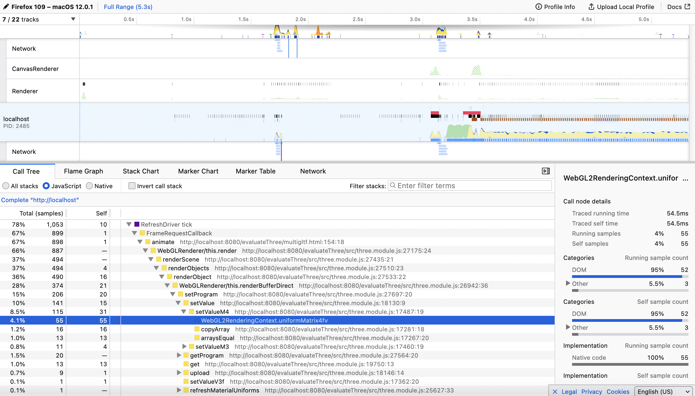

Set up the front end of the web dev tool of Firefox.

```sh
npm install
npm start
```

The time of the click, network transferring, and image decoding will be logged into the console. CPU usage will be written to the file and downloaded automatically.


#### safari-profiler

Use timelines in the web dev tool to record and download the profiled file. `detailedAnalysis/safari-profiler/data/localhost-recording.json` is an example.

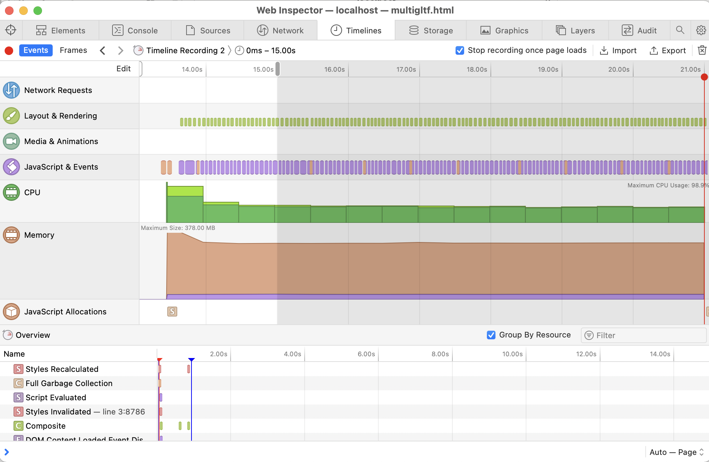

Use getinfo.js to analyze the file. The time of click and network transferring will be logged to the terminal, and CPU usage will be written to files.

```sh
node getinfo.js
```

### Power Analysis

Run `./energy/energy-pixel-odpm.sh` to read power rails

Run `./energy/energy-mi10.sh` to read current and voltage

## Main Results

We verify that large models can be simulated by multiple small models as long as they have similar model complexity. Therefore, we use boxes with different numbers of textures as small models and render them multiple times to simulate
different model complexity. For a single box, the number of textures ranges in [0,1,2,4], and the texture resolution is 2048 × 2048. The number of times the box will be reused for simulation ranges in [8,64,512,4096,32768].

As for mobile devices, we use mobile phones with different capacities and operating systems, including Pixel 6 (high-end, Android 12), Mi 10 (low-end, Android 12), and iPhone 12 (high-end, iOS 14). In addition, we run our experiments on the browsers of Chrome (105.0.5195.17), Firefox (108.2.0), and Safari (14). We set up a server on a macOS laptop and used the phone as a client to request the website. As for the frameworks, we use the latest released version.

### 3D Loading

#### First loading times

The first loading times of different frameworks and different 3D model complexity:

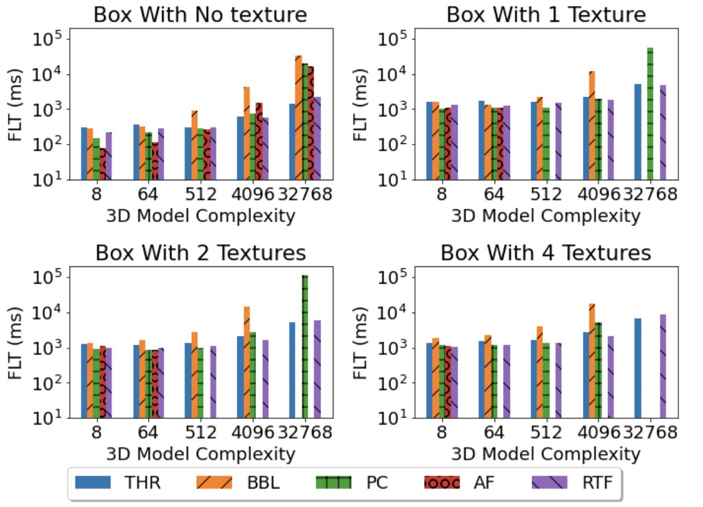

#### Usage during loading

The CPU scripting and GPU usage of different frameworks during loading 4096 boxes with four textures
(8 boxes for A-Frame):

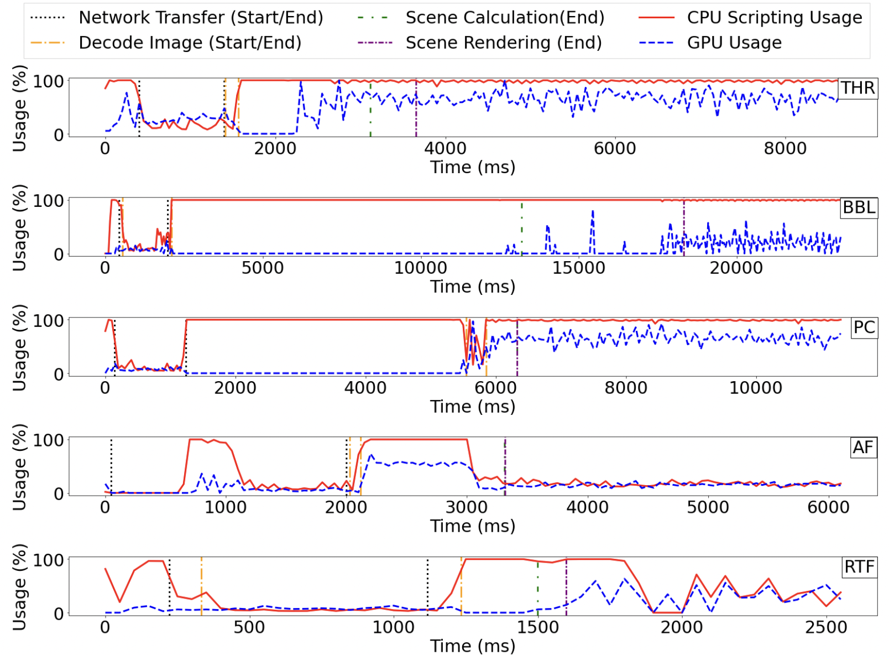

### 3D Rendering

#### FPS

FPS for different frameworks and different 3D model complexity:

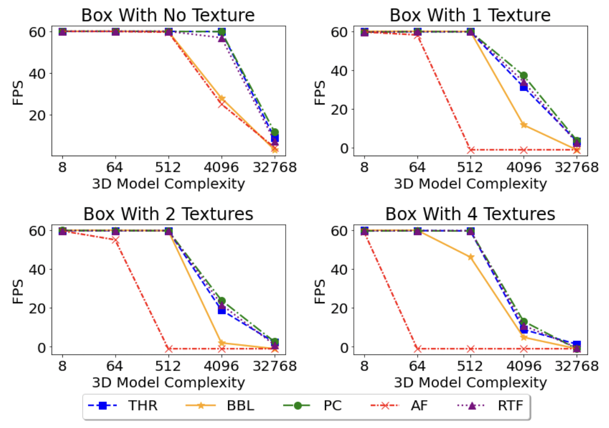

#### Usage during rendering

The average CPU scripting usage and GPU usage of different frameworks:

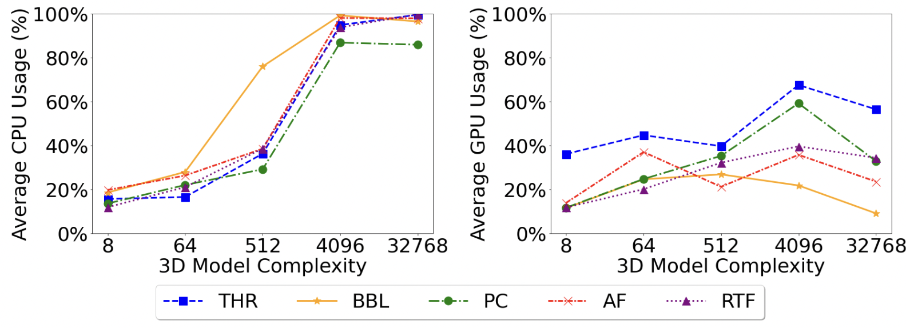

### Camera Capturing

The number of well-performed scenarios for different frameworks:

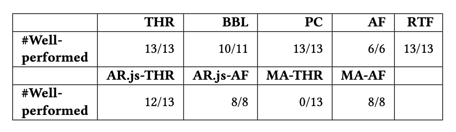

Relationship between first loading time and FPS (not well-performed) with and without camera capturing:

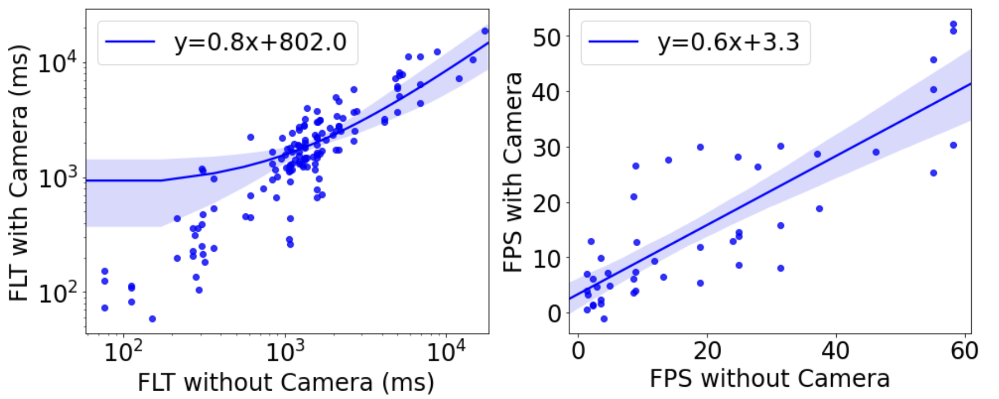

### Time Left for Real-world UnderStanding

Average frame time (ms) of different frameworks and different 3D model complexity:

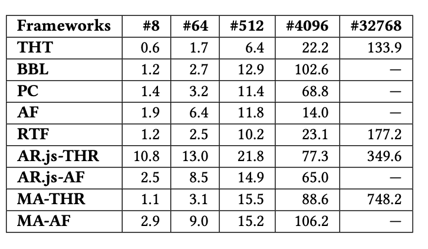

